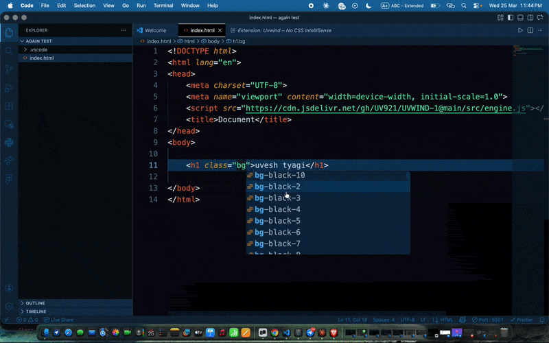

# 🚀 Uvwind

> Build UI without writing CSS.
> No config. No build step. Just classes.

---

<p align="center">
  <a href="https://uvwind-1.vercel.app/">🌐 Live Demo</a> •
  <a href="https://marketplace.visualstudio.com/items?itemName=UveshTyagi.uvwind-intellisense">🧩 VS Code Extension</a>
</p>

---

## ⚡ IntelliSense in Action



👉 Type utility classes and get instant suggestions directly inside VS Code.

---

## ✨ Features

* ⚡ No CSS files needed
* 🧠 IntelliSense (auto suggestions)
* 🎯 Faster development
* 🪶 Lightweight & zero config
* 🔥 Works with HTML & React

---

## 🚀 Quick Example

```html
<div class="p4 bg-blue-5 t-white">
  Hello Uvwind 🚀
</div>
```

---

## 🧠 How it works

Uvwind dynamically maps utility classes to styles —
no CSS file, no build step, no config.

---

## 📂 Project Structure

```bash
src/    → core engine  
docs/   → demo website + gif  
```

---

## 🌐 Links

* Live: https://uvwind-1.vercel.app/
* Extension: https://marketplace.visualstudio.com/items?itemName=UveshTyagi.uvwind-intellisense

---

## ⭐ Support

If you like this project:

👉 Star this repo
👉 Share it with others
👉 Give feedback

---

## 👨‍💻 Author

**Uvesh Tyagi**

---

## 📜 License

MIT
